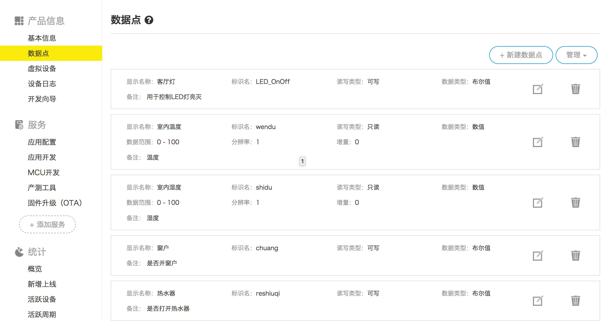

# samrt_home_sysytem
使用树莓派和Arduino搭建的一套物联网家庭环境监控系统，包含了人脸识别门禁，温湿度监测、灯光控制、语音播报、火灾报警。
# 项目简介

### 系统架构图

### 硬件清单

人脸识别部分：

* 树莓派3b
* tf卡16G以上
* 树莓派CSI摄像头500万像素

环境监控部分：

* Arduino UNO R3
* Arduino扩展板（可选购）
* 烟雾传感器MQ-2
* 温湿度传感器DHT-11
* 小功率风扇
* 彩色发光二极管若干
* 杜邦线若干
* OLED 0.96英寸
* SYN6288语音播放模块
* SG-90舵机（两个分别负责门和窗户）

网络通信部分：

* ESP8266-01WiFi模块
* HC-05 蓝牙模块

硬件采用了树莓派3B、Arduino UNO R3
软件包含了人脸识别脚本、移动端APP。

# 移动端
### APP效果图

### 辅助教程
[导入机智云Android开源项目的正确姿势](https://mp.weixin.qq.com/s/7bLe4kDZCb3LV1hVIsyTSw)
# 人脸识别部分
### 1. 效果图

### 2. 视频教程

[树莓派人脸识别门禁系统快速搭建教程](https://www.bilibili.com/video/BV1U741127yV?share_source=copy_web)

### 3. 图文教程
[树莓派调用被堵人脸识别API实现人脸识别](https://mp.weixin.qq.com/s/3XHD7qAZoI6dDmkXHQq3tA)

# 机智云物联网设置方式
### 相关技术参考文档
[Arduino使用ESP8266连接机智云物联网平台](https://mp.weixin.qq.com/s/4BdCiPhoKTxQN9QlWtzMsg)
### 机智云数据点设置情况

# 作者
